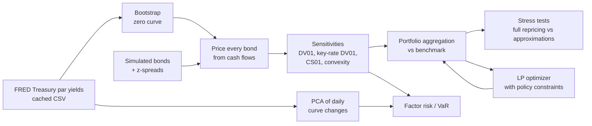

# Fixed-Income Risk Engine

[](https://github.com/crollila/fixed-income-risk-engine/actions/workflows/ci.yml)


This is a Treasury and investment-grade corporate bond pricing and portfolio-risk engine, written from scratch in Python. It
builds a yield curve from real U.S. Treasury data, prices every bond from its cash flows, measures interest-rate and
credit risk in dollars, runs stress tests, finds the main ways the curve actually moves (PCA), and then rebalances the
portfolio toward a target risk profile without breaking its investment limits.

> **Simulated portfolio, not real money.** The ~$100MM book, its benchmark, the corporate issuers (fictional names),
> their ratings, spreads and trading costs are all **manufactured for demonstration**. It is not client or real AUM.
> The only market data is the U.S. Treasury par curve (Federal Reserve H.15 via FRED), which is cached in the repo so
> everything runs offline.

Every number below was produced by `python -m firisk.run_all`. The README itself is generated from a template, and a
test checks that it matches the program output exactly.

---

## Headline results (valuation date {{val_date}})

| | Simulated portfolio | What it means |
|---|---:|---|
| Market value | **{{p_nav}}** | simulated book: {{n_tsy_held}} Treasuries + {{n_corp_held}} corporate bonds from {{n_issuers}} issuers in {{n_sectors}} sectors |
| Effective duration | **{{p_dur}} yrs** | if all yields rise 1%, the book loses roughly {{p_dur}}% (benchmark: {{b_dur}}) |
| DV01 | **{{p_dv01}}** per bp | dollars lost if every Treasury par yield rises 0.01% |
| Largest key-rate bucket | **{{p_kr_top}}: {{p_kr_top_v}}** per bp | {{p_kr_top_share}} of all rate risk; the 20Y+30Y points add another {{p_kr_long}} |
| CS01 | **{{p_cs01}}** per bp | dollars lost if every corporate credit spread widens 0.01% |
| Largest issuer / sector | {{p_max_issuer}} {{p_max_issuer_w}} / {{p_max_sector}} {{p_max_sector_w}} | both above policy limits ({{pol_issuer}} / {{pol_sector}}) |
| Worst stress | **{{worst_pnl}}** ({{worst_pct}}) | {{worst_sc}} |
| Duration-only error at +100bp | {{up100_err1}} ({{up100_err1_pct}}) | adding convexity cuts it to {{up100_err2}} ({{up100_err2_pct}}) |
| PCA: level / slope / curvature | {{ev1}} / {{ev2}} / {{ev3}} | share of daily curve-move variance, {{pca_start}} to {{pca_end}} |
| Constrained rebalance | duration {{p_dur}} → **{{r_dur}}** | key-rate gap to benchmark cut {{krgap_cut}}, all {{n_violations_before}} limit breaches fixed, {{turnover}} turnover, {{cost}} cost |

---

## How the engine fits together



None of the core math wraps a pricing library. Day counts, schedules, yields, bootstrapping, curve interpolation and every
sensitivity are implemented in `src/firisk/`. QuantLib is only used as an *optional* independent cross-check in the
test suite (`tests/test_quantlib_crosscheck.py`).

---

## Fixed income in ten minutes: a guided tour through the outputs

### 1. A bond is a list of promised cash flows

A bond pays a fixed **coupon** every six months and gives back its **face value** ($100 per $100 of bonds) at maturity.
Its fair price today is the sum of each payment's **present value**, meaning what that future dollar is worth now.


Two prices get quoted. **Accrued interest** is the part of the next coupon the seller has already earned since the last
payment date. The buyer pays the **dirty price** (clean + accrued), while screens show the **clean price**, which doesn't
jump on coupon dates. Treasuries count days *Actual/Actual* and U.S. corporates use *30/360*. Both are implemented, with
the month-end and February edge cases.

{{table:bond_examples}}

*Per $100 face. The Treasury STRIP is a zero-coupon bond: no coupons and no accrued interest, and its duration is close to its maturity.*

### 2. The yield curve: par, spot, forward and discount factors

Treasury publishes **par yields**: the coupon a new bond at each maturity would need to price at exactly $100. Pricing
needs **spot (zero-coupon) rates** instead, meaning the rate for a single payment at time *t*. The engine **bootstraps**
them. It solves the 1M, 3M and 6M bills first, then each coupon tenor in turn, so that every input instrument reprices
to par (largest error {{boot_err}} per $100). **Forward rates** are the rates the curve implies *between* two future
dates. A **discount factor** DF(t) is the value today of $1 paid at *t*.


On {{val_date}} the curve slopes upward (2Y {{par2}}, 10Y {{par10}}, 30Y {{par30}}) with the familiar 20-year hump.
The step-shaped forward curve comes from the interpolation choice (log-linear discount factors give piecewise-flat
forwards). It is easy to see that the 10–20Y forward has to sit high, because the 20Y par yield is above both its neighbours.

### 3. Yield, duration and convexity: how price reacts to rates

**Yield to maturity** is the single discount rate that reproduces a bond's price. When yields go up, prices go down.
**Duration** is the slope of that relationship: a duration of 14 means about a 14% price drop for a 1% rise in yield.
The relationship is curved, though. **Convexity** measures the bend, and for an ordinary bond it always works in the
holder's favour.


The engine reports *Macaulay* duration (the weighted-average time to cash flows), *modified* duration (sensitivity to
the bond's own yield) and *effective* duration (full repricing after shifting the whole Treasury curve and
re-bootstrapping). Effective is slightly larger than modified in the table above because a 1bp move in *par* yields
moves long *zero* rates by a little more than 1bp.

### 4. Risk in dollars: DV01 and key-rate DV01

Traders think in dollars per basis point (1bp = 0.01%). **DV01** is the loss from a 1bp rise in rates. **Key-rate DV01**
breaks that into the points of the curve where the risk lives. Each of the 11 Treasury par tenors is bumped on its own
and the whole book is repriced.


{{table:kr}}

The simulated book runs **{{active_dur}} years longer** than its benchmark, and almost all of the extra risk sits at
10Y–30Y. The key-rate buckets add back to the parallel DV01: {{kr_sum}} against {{p_dv01}}, a {{kr_recon}} difference.
Portfolio DV01 from repricing the whole book ({{dv01_full}}) equals the sum of the individual bond DV01s ({{dv01_sum}}).

### 5. Credit risk: spreads, CS01 and concentration

Corporate bonds yield more than Treasuries because the issuer could default. The engine prices each corporate at a
**z-spread** over the Treasury zero curve. **CS01** is the loss if that spread widens by 1bp, and **spread duration** is
the same measure as a percentage. Treasuries are the risk-free reference and carry no credit risk by construction.

| Rating | Weight | CS01 |
|---|---:|---:|
| AA | {{p_mv_AA}} | {{p_cs01_AA}} |
| A | {{p_mv_A}} | {{p_cs01_A}} |
| BBB | {{p_mv_BBB}} | {{p_cs01_BBB}} |
| **Corporates total** | **{{p_corp_w}}** | **{{p_cs01}}** |


The starting book breaks three simulated policy limits: Atlas Bancorp at {{p_max_issuer_w}} (limit {{pol_issuer}}),
Financials at {{p_max_sector_w}} (limit {{pol_sector}}) and Treasuries at {{p_tsy}} (minimum {{pol_tsy}}). The
**maturity ladder** below shows where the money sits by years to maturity:


### 6. Stress tests: what happens on a bad day, and how good are the shortcuts?

Every scenario fully reprices every bond on a shocked curve. The result is then compared with the two shortcuts risk
desks use: **first-order** (key-rate DV01 × shock + CS01 × spread shock) and **second-order** (first-order plus convexity).


{{table:stress}}

*Steepener: 2Y and shorter −25bp, 10Y and longer +25bp, linear in between. Credit widening is tiered by rating
(AA +30, A +50, BBB +80bp).*

Duration alone misses by up to {{max_err1_pct}} of the true P&L. Adding convexity brings the worst miss down to
{{max_err2_pct}}. The chart below shows the textbook behaviour: the duration-only error grows with the **square** of the
shock and the convexity-corrected error with its **cube**. Fitted log-log slopes over 2–50bp shocks are
{{conv_slope1}} and {{conv_slope2}} (theory: 2 and 3).


For the combined scenarios, P&L is split into a rates part, a spread part and their interaction. In the stagflation case,
{{stag_rates}} comes from rates, {{stag_spread}} from spreads and {{stag_inter}} from the interaction:


### 7. How the Treasury curve really moves: PCA

Rather than assuming shapes like "parallel" or "steepener", the engine learns them from {{pca_n}} daily changes in
Treasury par yields ({{pca_start}} to {{pca_end}}, 1Y–30Y). It removes the average change, computes the covariance
matrix and takes its eigenvectors (principal components):


The labels are assigned by counting sign changes across tenors, not by hand:

* **PC1 = {{pc1_label}} ({{ev1}})**: every tenor moves the same way (loadings {{pc1_min}} to {{pc1_max}}).
* **PC2 = {{pc2_label}} ({{ev2}})**: the short end and long end move in opposite directions ({{pc2_short}} at 1Y, {{pc2_long}} at 30Y).
* **PC3 = {{pc3_label}} ({{ev3}})**: the belly moves against both wings.

Together they explain **{{ev123}}** of daily curve variance. Key-rate DV01 is measured on the same par tenors, so the
portfolio's factor exposure is just a dot product:

{{table:pca}}

Rate-risk daily volatility is {{sigma_day}}, which gives a parametric 99% one-day VaR of {{var99}}. A first-order
historical simulation, replaying every past day's curve move against today's key-rate DV01s, gives {{hvar99}}. The
worst replayed day was {{worst_day}}, on {{worst_day_date}}.

### 8. Rebalancing under constraints

A linear program (HiGHS via `scipy.optimize.linprog`) chooses buys and sells that move the book's 11 key-rate durations
and its total duration toward the benchmark's. Every trade has to respect the policy:

* max {{pol_issuer}} per corporate issuer and {{pol_sector}} per corporate sector;
* at least {{pol_tsy}} in Treasuries;
* one-way turnover of at most {{pol_turn}};
* max {{pol_pos}} in any one bond, long only;
* the trades must pay for themselves *after* simulated bid-ask costs.

{{table:constraints}}

{{table:trades}}

| | Before | After | Benchmark |
|---|---:|---:|---:|
| Effective duration | {{p_dur}} | **{{r_dur}}** | {{b_dur}} |
| DV01 | {{p_dv01}} | **{{r_dv01}}** | {{b_dv01}} |
| CS01 | {{p_cs01}} | **{{r_cs01}}** | {{b_cs01}} |
| Key-rate duration gap (sum of absolute differences, yrs) | {{krgap_before}} | **{{krgap_after}}** | 0 |
| Yield | {{p_ytm}} | {{r_ytm}} | {{b_ytm}} |
| Parallel +100bp P&L | {{up100_full}} | **{{r_up100_full}}** | |
| Stagflation P&L | {{stag_full}} | **{{r_stag_full}}** | |

The turnover limit binds ({{turnover}} against {{pol_turn}}), so the book lands close to the target duration but not
exactly on it. Long Treasuries are the cheapest risk to sell (simulated costs of 0.5–3.5bp against 8–22bp for corporates), so
the optimizer cuts duration mostly through Treasuries and keeps most of the credit. DV01 falls {{dv01_cut}} and CS01
falls {{cs01_cut}}. The cost is {{ytm_change_bp}}bp of yield.

---

## What is validated

`pytest` runs {{n_tests}} test functions. Most of them check the engine against *independent* closed-form math rather
than against its own output:

| Property | Check |
|---|---|
| Zero-coupon identity | price = 100 / (1 + y/2)^(2T) and = 100·DF(T) under a curve |
| Par bond at par | coupon = yield on a coupon date → price 100; bootstrapped par instruments reprice to 100 |
| Closed forms | annuity price formula, closed-form par-bond Macaulay / modified duration, textbook 6%/8%/10y price |
| Monotonicity | price strictly decreases as yield rises (grid of yields, every bond) |
| DV01 | analytic derivative vs central finite difference |
| Convergence | duration+convexity error shrinks ~cubically as the shock shrinks, duration-only ~quadratically |
| Dates & accrual | end-of-month schedules (Feb 28/29 ↔ Aug 31), settle on coupon date (accrued 0, coupon excluded), 30/360 day-31 and February rules, final-period simple yield |
| Key-rate reconciliation | key-rate DV01s sum to parallel DV01 per bond and per portfolio |
| Aggregation | portfolio DV01/CS01/KR by full repricing = sum of positions |
| Optimizer | every limit holds after rounding and costs; infeasible limits raise; costs reduce turnover |
| PCA | recovers known eigenvectors from a synthetic covariance; sign conventions; explained variance sums to 1 |
| Reproducibility | README / ANALYSIS / RESUME_BULLETS re-render exactly from the saved results |
| QuantLib (optional) | clean price, accrued, yield and duration match QuantLib for a Treasury and a 30/360 corporate |

## Reproduce

```bash
python -m venv .venv && source .venv/bin/activate   # Windows: .venv\Scripts\activate
pip install -r requirements.txt && pip install -e . --no-deps
python -m firisk.run_all      # results/, figures/, README.md, ANALYSIS.md, RESUME_BULLETS.md
pytest                        # full test suite
```

It runs fully offline from `data/cache/fred_treasury_cmt.csv` ({{hist_rows}} days, {{hist_start}} to {{hist_end}}). To
refresh the cache from FRED (this changes the results), run `python -m firisk.data --refresh` and update `VALUATION_DATE`
in `src/firisk/config.py`. If the cache is missing, a clearly labeled synthetic curve history is generated instead.
Seeds are fixed (`SEED = 7` for simulated spreads).

## Repository layout

```
src/firisk/
  daycount.py   ACT/ACT (ICMA), 30/360 US, ACT/365F
  schedule.py   coupon schedules with end-of-month rule
  bond.py       cash flows, accrued, clean/dirty, YTM, Macaulay/modified duration, convexity
  curve.py      zero curve: discount factors, spot, forward rates
  bootstrap.py  par-curve bootstrapping
  market.py     market state + vectorized curve pricing, z-spreads
  risk.py       effective duration/convexity, DV01, key-rate DV01, CS01, spread duration
  universe.py   SIMULATED bonds, portfolio, benchmark, policy, spreads, costs
  portfolio.py  aggregation, concentration, credit exposure, ladder
  scenarios.py  stress scenarios, full repricing vs 1st/2nd-order, attribution
  pca.py        curve PCA, factor risk, VaR
  optimizer.py  constrained LP rebalance + independent constraint checker
  report.py     results files + template rendering;  plots.py figures;  run_all.py entry point
  compare.py    tolerance-based results comparison used by CI
templates/      README / ANALYSIS / RESUME_BULLETS templates (every number is a template token)
results/        CSV/JSON outputs (summary.json, holdings, stress, PCA, trades, constraints)
figures/        PNG charts
tests/          pytest suite
```

## Conventions and simplifications

* Settlement = valuation date (T+0). Coupon dates are unadjusted for business days.
* The Treasury curve is bootstrapped from H.15 constant-maturity par yields on a stylized semiannual grid: bills ≤ 6M
  are simple-interest zeros, and coupon tenors are par bonds with exact 0.5-year periods. Interpolation is log-linear in
  discount factors.
* Corporate prices are generated from synthetic z-spreads (rating base + term premium + sector + seeded issuer noise),
  so spreads and prices are internally consistent but not market observations.
* Stress P&L is instantaneous (no carry or roll-down). Spread shocks are parallel within each rating tier.
* PCA uses 1Y–30Y. With the bills included, the third factor turns into a 1M-bill factor (loading {{all_pc3_1m}} at 1M;
  explained variance {{all_ev1}} / {{all_ev2}} / {{all_ev3}}), driven by debt-ceiling and policy episodes. See
  [ANALYSIS.md](ANALYSIS.md).
* Historical VaR is first order (key-rate DV01 × historical changes) and covers rates only.

## Data

U.S. Treasury constant-maturity yields: Board of Governors of the Federal Reserve System, H.15 Selected Interest Rates,
retrieved from FRED (Federal Reserve Bank of St. Louis): series DGS1MO, DGS3MO, DGS6MO, DGS1, DGS2, DGS3, DGS5, DGS7,
DGS10, DGS20, DGS30. Retrieval metadata is in `data/cache/fred_treasury_cmt.meta.json`.

## Glossary

| Term | Plain-English meaning |
|---|---|
| bp | basis point, 0.01% |
| Clean / dirty price | price without / with the accrued coupon |
| YTM | the single discount rate that reproduces the price |
| Spot (zero) rate | rate for one payment at a single future date |
| Forward rate | rate locked in today for borrowing between two future dates |
| Duration | % price change for a 1% (100bp) parallel yield move |
| Convexity | how much duration itself changes as yields move (the curvature) |
| DV01 / PV01 | $ change for a 1bp rate move |
| Key-rate DV01 | DV01 for a bump at one maturity point only |
| Z-spread | constant extra discount rate over the Treasury zero curve that matches the bond's price |
| CS01 / spread duration | $ / % change for a 1bp move in the credit spread |
| PCA | statistical method that finds the few independent patterns explaining most curve moves |
| Turnover | fraction of the book traded (one-way: buys only) |

## License

MIT. See [LICENSE](LICENSE).
